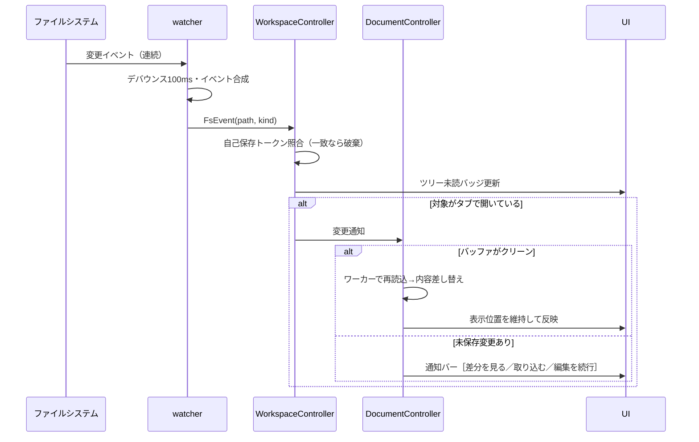

# pika 設計書

> **【Tauri フル刷新で部分改訂・2026-06-21】** 本書は wxWidgets/C++ 実装向けに書かれた。Tauri フル刷新フェーズでは
> **技術手段に関わる 2章（アーキテクチャ）・3章（モジュール）・12章（リポジトリ構成）・14章（実装順序）の
> 具体実装は `docs/specs/2026-06-20-tauri-rewrite-architecture-design.md`（design doc）2/3/4/13/14章へ載せ替えた**。
> 矛盾する場合は design doc が正。ただし 1章の**設計原則の優先順位**（データを失わない＞固まらない＞軽い＞足さない＞
> 速く作る）・補助原則のうち「**コアは UI を知らない**」「**ワークスペースを汚さない**」「コア公開 API は
> **`Result<T>` 方式**」は維持する（design doc 1章/16章で明記）。「ネイティブ優先・WebView2 はプレビュー/差分のみ・
> UI 系依存追加禁止」は廃し「全Web描画・未信頼文書は権限ゼロ別WebView で隔離」へ置換した。
> 巨大ファイル数値（要件2.2/5.4/9.2）は sprint 6 の CM6 実測で確定する（TBD）。

## 0. 本書の位置づけ

* 上位文書：`minimal-plan.md`（コンセプト）→ `requirements.md`（何を作るか）→ **本書（どう作るか）**
* **Tauri 刷新の技術手段は `docs/specs/2026-06-20-tauri-rewrite-architecture-design.md` が正典**（本書 2/3/12/14章の上書き）
* 目的：(1) アプリ全体の構造を俯瞰できるようにする、(2) 実装中の設計判断がブレないよう基準を固定する
* 本書が定めるのは構造・境界・方針であり、関数シグネチャやクラスの完全な定義は実装の裁量とする
* 要件定義と矛盾が見つかった場合は要件定義を正とし、本書を修正する

## 1. 設計原則（迷ったらこの優先順位）

実装中の判断はすべて以下の優先順位に従う。上位の原則を満たさない選択肢は採らない。

1. **データを失わない** — 人間の編集もAIの変更も、どんな操作・異常系でも復元可能であること（退避スナップショットが最後の砦）。index.json が破損しても退避を放棄せず、objects の自己記述メタ（7章）から復元待ち一覧を提示してから索引を再生成する。容量GC・件数LRU・90日削除は、未復元退避の保護（要件9.3）を侵さない範囲でのみ行う
2. **固まらない** — UIスレッドで200ms超のブロックをしない。重い処理は必ずワーカーへ。AI出力（＝非定型）を主対象とするため、プレビュー・画像のレンダリング暴走ガード（既定：画像6000万px・SVG展開8000万px相当/要素5万・レンダリングタイムアウト10秒。要件2.2）は既定で有効とし、超過入力はレンダリングせず外部アプリへ誘導する
3. **軽い** — 使っていない機能のコストはゼロにする（遅延初期化・オンデマンド生成）。依存ライブラリの追加はバイナリサイズと天秤にかける
4. **足さない** — 要件定義14章「やらないこと」に載っている機能は実装しない。載っていない新機能を思いついたら、実装せずに要件定義の改訂を提案する
5. **速く作る** — 上記4つを満たす範囲で、最も単純な実装を選ぶ

補助原則：

* **ネイティブ優先**：UIはwxWidgetsネイティブで作る。WebView2に寄せてよいのはプレビューと差分表示だけ（要件1章）
* **コアはUIを知らない**：`core/` 配下のモジュールはwxWidgetsのUIクラスに依存しない（テスト可能性とモジュール疎結合の担保）
* **ワークスペースを汚さない**：ユーザーのフォルダにpikaのファイルを一切作らない（要件9.1）

## 2. 全体アーキテクチャ

### 2.1 レイヤー構成

```mermaid
graph TD
    subgraph UI層（UIスレッド / wxWidgets）
        MF[MainFrame<br>メニュー・レイアウト・通知バー]
        TREE[FileTreePanel<br>ツリー＋未読バッジ]
        TABS[TabManager<br>タブ・モード切替]
        ED[EditorView<br>wxStyledTextCtrl]
        PV[PreviewView<br>wxWebView/WebView2]
        DF[DiffView<br>wxWebView/WebView2]
    end
    subgraph アプリケーション層（UIスレッド）
        AC[AppController<br>起動・終了・CLI受信の指揮]
        WS[WorkspaceController<br>フォルダ・未読・既読操作]
        DC[DocumentController<br>開く・保存・衝突処理]
    end
    subgraph コアサービス層（ワーカースレッド可 / UI非依存）
        WATCH[watcher<br>ファイル監視]
        DIFF[diff<br>差分計算]
        SNAP[snapshot<br>ベースライン・退避]
        REND[render<br>md4c・HTML生成・JS検知]
        SET[settings<br>TOML読み書き]
        IPC[ipc<br>シングルインスタンス]
    end
    subgraph プラットフォーム層
        FS[ファイルシステム / Win32 API / WebView2 Runtime]
    end
    MF --> AC
    TREE --> WS
    TABS --> DC
    ED --> DC
    AC --> WS
    AC --> DC
    WS --> WATCH
    WS --> SNAP
    DC --> SNAP
    DC --> DIFF
    DC --> REND
    AC --> SET
    AC --> IPC
    WATCH --> FS
    SNAP --> FS
    IPC --> FS
```

### 2.2 依存規則

* 依存方向は常に「UI層 → アプリケーション層 → コアサービス層 → プラットフォーム層」。逆方向の参照は禁止
* コアサービス層からUIへの通知は、コールバック（`std::function`）またはイベントキュー経由でのみ行う。コアがwxのウィンドウクラスを直接触ることは禁止
* コアサービス同士は原則独立。連携が必要な場合はアプリケーション層が仲介する（例：watcherの変更通知を受けてsnapshotに問い合わせるのはWorkspaceController）。ただし `core/settings` の `settings.toml` 自己監視に限り `core/watcher` を直接利用してよい**明示的な例外**とする（設定ファイル1個の監視のためにアプリ層仲介や別実装を起こさない。初期化順序は5.1で固定し、起動最序盤の同期読み込みは監視と独立に行う）。これ以外のコア間直接依存は引き続き禁止

## 3. モジュール設計

| モジュール | 責務 | 主な公開概念 | 依存 |
|---|---|---|---|
| `app` | エントリポイント、CLI引数解析（`-g` 行/桁パース）、データルート解決（`portable.txt` 検出。要件13章）、シングルインスタンス判定、ウィンドウ生成前の引数検証の同期実行（失敗は非0終了）。`--help`/`--version` とコールド起動の検証・終了コードはコンソールサブシステムの薄いスタブ（`pika.com`）で扱い、検証成功時のみGUI本体へ橋渡しする | `main`, `CliArgs`, `DataRoot` | ipc, settings |
| `ui` | wxWidgetsの全ウィンドウ・パネル・ダイアログ・通知バー・テーマ適用・About（サードパーティライセンス表示）。ユーザー向け文言は単一のメッセージ定義（ID→日本語文字列）経由で取得し、UIクラスに生文字列を直接書かない | `MainFrame`, `FileTreePanel`, `EditorView`, `PreviewView`, `DiffView`, `NotificationBar`, `Strings` | アプリケーション層 |
| `controller` | UIとコアの仲介。ユースケースの手順（開く・保存・衝突・既読化）を実装 | `AppController`, `WorkspaceController`, `DocumentController` | core全般 |
| `core/document` | 開いている文書の**メタ状態**：エンコーディング/改行、dirty、衝突状態、巨大ファイル段階。テキスト本体はScintillaが保持し、DocumentModelはテキストを複製保持しない（差分/プレビュー/保存へ渡す内容はその時点のScintillaバッファから生成する `shared_ptr<const std::string>`） | `DocumentModel`, `DocState` | util |
| `core/workspace` | フォルダ状態：ツリーモデル、未読集合、除外リスト適用、フォルダ外ファイルの管理 | `WorkspaceModel`, `UnreadSet` | util |
| `core/watcher` | `ReadDirectoryChangesW` のラップ。デバウンス、イベント合成（連続書き込み→1イベント）、rename/削除の正規化、自己保存イベントの抑制 | `FileWatcher`, `FsEvent` | util |
| `core/diff` | 行差分（Myers/dtl）＋行内の単語/文字単位ハイライト計算。キャンセル可能 | `DiffEngine`, `DiffResult` | util |
| `core/snapshot` | ベースライン・退避の保存/復元、ハッシュ計算（LF正規化後XXH3）、圧縮、容量管理（件数LRU・容量GC・90日GC・未復元退避保護）、機密ファイルのハッシュのみ記録・手動パージ、object削除のmark-and-sweep（参照ゼロ確認）、起動時未読判定 | `SnapshotStore`, `BaselineIndex` | util |
| `core/render` | md4cによるMarkdown→HTML、**ホワイトリスト方式サニタイズ**（許可タグ・属性のみ。インラインSVG無害化・CSS `url()`/`@import` 遮断）、プレビュー用HTMLテンプレート組み立て、JS依存検知（`<script>`/Tailwind CDN）、外部リソース参照検知、レンダリング暴走ガード判定（SVG要素数/展開ピクセル数・HTML要素数/ネスト深さ）、テーマCSS注入 | `MarkdownRenderer`, `HtmlInspector`, `PreviewBuilder` | util |
| `core/search` | ファイル内検索・置換のエンジン（PCRE2、pcre2-16/UTF対応。後方参照・キャプチャ参照・Unicode文字クラス）。巨大/長行入力はワーカーで実行しキャンセル可 | `SearchEngine` | util |
| `core/settings` | settings.toml の読み込み・検証・既定値フォールバック・変更監視（**読み取り専用＝pikaは書き戻さない**。パース失敗時は直前の有効値を維持） | `Settings`, `SettingsWatcher` | util, watcher |
| `core/ipc` | 名前付きパイプ `\\.\pipe\pika-<ユーザーSID>`（作成者ユーザーのみのDACL＋`PIPE_REJECT_REMOTE_CLIENTS`）のサーバー/クライアント。パイプ作成成否を原子的ロックとする `TryAcquire`、後続起動の引数転送（JSON 1行・最大数KB・スキーマ検証・不正は破棄） | `IpcServer`, `IpcClient` | util |
| `util` | ログ、エンコーディング判定（BOM→候補順デコード妥当性検査）/変換（書き出し時の表現可能性チェック付き）、アトミック書き込み、ハッシュ（XXH3）、スレッドプール、パス正規化 | `Logger`, `EncodingDetector`, `AtomicFile`, `TaskRunner` | なし |

設計メモ：

* `core/` と `util` はwxWidgets非依存とし、単体テスト対象にする（13章）。ただし文字列型は実装簡略化のため `std::string`（UTF-8）に統一し、Win32境界でUTF-16へ変換する
* `DocumentModel` は文書の**メタ状態**の真実（single source of truth）を持つが、テキスト本体はScintillaが保持する。Scintillaのバッファ内容はUIスレッドでのみ読み書きし、差分・プレビュー・保存へ渡すときはその時点のバッファからイミュータブルなコピー（`std::shared_ptr<const std::string>`）を生成する（DocumentModelはテキストを複製保持しない）

## 4. スレッディングモデル

| スレッド | 役割 | 禁止事項 |
|---|---|---|
| UIスレッド | wxWidgets全UI、Scintilla操作、WebView2操作（STA要件） | 200ms超のブロック処理。ファイルI/O・差分計算・ハッシュ・圧縮・md4c変換を直接呼ばない |
| ワーカープール（`TaskRunner`、2〜4本） | ファイル読み込み、差分計算、スナップショット保存/GC、Markdown変換、起動時未読判定 | UIオブジェクトへのアクセス |
| 監視スレッド（watcherが所有） | `ReadDirectoryChangesW` の待機、デバウンスタイマー | 重い処理（イベントを合成してキューに積むだけ） |
| IPCスレッド | 名前付きパイプの待機。受信JSONの長さ制限・スキーマ検証・不正データ破棄 | 同上 |

ルール：

* ワーカー→UIの結果通知は `wxQueueEvent` / `CallAfter` で行う。UIスレッド側は受信時に「結果がまだ有効か」を世代カウンタで検証してから適用する。世代カウンタは2層持つ：(a)文書単位＝バッファ変更・外部リロードで+1、(b)WebView占有単位＝**タブ/モード/差分トグルON-OFF**の切替で+1（差分トグルもWebView内容を変えるため切替軸に含める。ui-design 8章）。1枚共有WebView（6章）への結果適用前に両方を照合し、別タブ/別モード/別差分状態へ切替済みなら破棄する
* キャンセル方針：差分計算・プレビュー変換・検索/全置換は文書ごとに最新リクエストのみ有効。古いタスクは協調キャンセル（アトミックフラグ）。ただしdtl（Myers差分）やmd4c変換は1回の呼び出しがブロッキングで内部にキャンセル点がないため、入力サイズで開始前に上限判定し、超過時は計算を開始せずフォールバック表示する（タイムアウトは別スレッド中断ではなく開始前の見積りで担保）。長い差分でワーカープールが飢餓しないよう、差分に専用枠/優先度を設ける
* ワーカー内の例外はすべて捕捉し、ログ＋通知バー表示に変換する（アプリを落とさない）

## 5. 主要フロー設計

### 5.1 起動（性能予算：ウィンドウ表示500ms以内）

1. `main`：データルート解決（`portable.txt` 検出。要件13章）→ CLI解析（`-g` パース）→ 引数検証を同期実行（存在しないフォルダ等は非0で即終了。GUIを起動しない）。`--help`/`--version` とコールド起動の検証・終了コードはコンソールスタブ（`pika.com`）が担う
2. 単一インスタンスのロック獲得：名前付きパイプ作成（`CreateNamedPipe`）を原子的ロックとして試行する。**獲得した1プロセスのみ**がサーバー兼ウィンドウになる。獲得に失敗した（既存インスタンスあり）プロセスはクライアントとして引数を絶対パス化のうえ転送し、終了コード0（受理）で即終了する（敗者のフォールバック）。サーバー公開はウィンドウ表示前に完了させTOCTOUレースを防ぐ
3. wx初期化 → `MainFrame` 生成・表示（**ここまでを最短経路にする**。設定読み込みは同期だが軽量で watcher 非依存、状態ファイルは読むのみ）
4. 表示後に非同期で：ツリー列挙（深さ優先・逐次追加）／監視開始（settings.toml の自己監視もここで）／指定ファイルのロード／起動時未読判定（mtime+サイズ→不一致のみハッシュ。`unread.fullHashOnStartup` オン時は全件ハッシュ照合をバックグラウンド継続＋進捗表示）／状態復元時の各タブのパス存在検査（消失は削除済み表示で開く、ワークスペース消失は空状態へ）／ジャンプリスト更新
5. WebView2はこの時点では**何もしない**（プレビュー初回要求まで生成しない）

### 5.2 外部変更の反映（要件7章）



* **自己保存の抑制**：pikaが保存する直前に「保存トークン」（パス＋保存後ハッシュ＋時刻）を登録する。watcherイベント処理時は**内容ハッシュ一致を必須条件**として消し込む——現ディスク内容のハッシュが保存後ハッシュと一致する場合のみ自己イベントとして**1回だけ消費（ワンショット）**する。時刻窓は古いトークンをGCするための補助的安全弁に過ぎず、窓を超過してもハッシュが一致すれば自己保存として抑制し、ディスク内容が保存後ハッシュと異なれば外部変更として処理する（リトライ・デバウンス・大ファイル保存の遅延を吸収）。保存後ハッシュが取れないケースは外部変更として扱う
* **アトミック置換の検知**：一時ファイル作成→rename は「対象パスへのrename到着」を変更として扱う。rename_old/rename_newペアの正規化はwatcher内で行い、ペアが時間窓内に揃わない場合は安全側に倒す（OLD単独＝削除扱い、NEW単独＝新規扱い、既存ファイルへの上書きrename＝対象パスの内容変更扱い）
* **確定読み（中途内容の防止）**：直近変更からデバウンス分の静穏期間を待ち、かつmtime/サイズが連続イベント間で安定したことを確認してから内容を確定読みする（共有モードで書く実装の末尾欠損を防ぐ）。共有違反（ERROR_SHARING_VIOLATION）は100ms間隔で最大5回リトライ後、上限を超えたらベースライン確定を保留し通知バーでエラー表示（中途内容でベースラインを汚染しない）
* **バッファオーバーフロー回復**：`ReadDirectoryChangesW` が `ERROR_NOTIFY_ENUM_DIR`（バッファ溢れ）を返したら、該当監視ルートの全再列挙→mtime/サイズ→ハッシュ比較で未読・ベースラインを再同期する（取りこぼし防止）。監視バッファは既定64KB（設定可）
* **監視不能環境のフォールバック**：ネットワークドライブ/UNC/一部クラウドで監視が機能しない場合は定期ポーリング（既定5秒・設定可。起動時未読判定と同じmtime+サイズプレスクリーンを再利用）へ切り替える。F5（要件11.2）は同じ再同期処理をオンデマンドで実行する
* **rename追従**：watcherが正規化したrenameイベントを受けて、WorkspaceControllerが `index.json` のエントリを新relPathへ付け替える（未読状態・ベースライン・退避を引き継ぐ。要件4.2）。リネーム先に既存エントリがある場合は移動元で上書き、相互スワップ（A↔B）は一時バッファ経由でアトミックに付け替え、対応付けが確定できない場合は最終ディスク内容で未読を再判定する。外部移動でwsKeyが変わる場合は旧wsKey配下の台帳と参照objectを新wsKeyへ移送し、移送不能時はベースラインを再取得して退避は旧キーに残し90日GCに委ねる。開いているタブのパス追従はDocumentControllerが行う
* **クリーン時の自動リロード**：未保存変更がないタブへの外部変更反映は、Scintillaの内容差し替えを単一のUndoアクションとして行い、リロード前の状態へCtrl+Zで戻せるようにする（リロード自体はdirtyにしない。要件7.2）
* **settings.toml の監視**：文書監視と同じデバウンス・アトミック読み取りを流用する。settings.toml は読み取り専用（pikaは書き戻さない）ため自己イベント抑制は不要。パース失敗時は直前の有効値を維持する（要件10.3）

### 5.3 保存（要件5.5・7.3）

1. 保存前チェック：**現ディスク上の実内容を読んでハッシュを計算**し（キャッシュ値を使わない）、「最後に読み込んだ時点」と異なれば衝突 → 上書き確認＋ディスク内容を `incoming` 退避（snapshot）してから保存。rename置換直後でも現実内容で再計算するため取りこぼさない（F5）
2. 表現可能性チェック：保存内容が現エンコーディングで表現できない文字を含む場合は保存を中断し、通知バーで［UTF-8で保存／該当文字を確認／キャンセル］を提示する（UTF-8/UTF-16は検査不要。G2）
3. 退避不能ガード：対象が10MB以上等で退避を取れない場合、上書き保存は既定でブロックする（設定で強い確認に切替可。要件7.3）
4. 保存トークンは発行直前に登録し、保存後ハッシュは `ReplaceFile`／新規直接作成の**完了後**を基準に確定する（F1）。書き込みは一時ファイル → `ReplaceFile`（アトミック・属性/ACL維持）
5. エンコーディング・BOM・改行は読み込み時の記録どおりに復元する（`core/document` が保持）

### 5.4 既読化（要件8章）

* 「確認済みにする」＝対象ファイルの**ディスク内容**でベースラインを更新（未保存があれば先に保存を促す）→ 未読集合から除去 → ツリー/タブのバッジ解除。差分ビュー経由の場合は差分計算時のディスクスナップショットを採用し、確定直前にmtime/ハッシュを再照合して不一致なら中断・再差分（E2。ユーザーが見ていない内容をベースライン化しない）。タブ未オープンのファイルはディスクから直接読み込む（規則はタブ経路と同一。E5）。内容を持たないファイル（10MB以上・画像）はハッシュベースラインのみ更新（D3）
* 「すべて確認済みにする」＝開始時点の未読集合をフリーズ → 各ファイルの旧ベースラインを `baseline-replace` 退避（同一バッチIDで一括取消可能・件数LRUとは別保持）→ 開始時と一致するファイルのみベースライン更新・処理中に変化したファイルはスキップ（未読のまま）→ 完了後に一括取消を提示。ワーカー実行。フォルダ単位の一括既読も同一APIで（E3/J6）
* 「確認済み時点に戻す」＝現在のディスク内容を `rollback` 退避に保存 → ベースライン内容でディスクを上書き（保存トークンで自己イベント抑制）→ バッファ再読込。退避を取れないファイル（10MB以上・画像、内容objectを持たない）は巻き戻しを提供しない（D3）

### 5.5 プレビュー更新（要件6章）

1. 編集 → 150msデバウンス → その時点のScintillaバッファのコピー（`shared_ptr<const std::string>`）をワーカーへ（I9。差分・プレビューで見る内容を統一する）
2. ワーカー：md4cでHTML化 → ホワイトリスト方式サニタイズ → テンプレート合成（世代番号付き）
3. UIスレッド：WebView2へ反映。スクロール復元は `NavigationCompleted` 受信後に実行し、その時点で占有世代（4章）を再照合する。完了前に別タブ/別モードへ切替済みなら復元しない（I3。前内容の上で位置設定→新内容ロードでリセットされる競合を防ぐ）

### 5.6 フォルダ切替（要件3.2）

0. 起動中インスタンスへの引数転送は単一キューに積み、UIスレッドで1件ずつ直列処理する（確認ダイアログ表示中に届いた次のリクエストはキューで待機させ、並行転送による切替競合を防ぐ。H3）
1. 未保存タブの確認（保存／破棄／キャンセル。キャンセルで切替を中止）
2. 現ワークスペースの後始末：watcher停止 → `index.json`／`state.json` を書き出し → タブ・ツリーを閉じる
3. 新フォルダに対して5.1の手順4（ツリー列挙・監視開始・未読判定）を実行する。WebView2・ワーカープールは生成済みのものを再利用する

### 5.7 文字コードの再指定（要件5.2）

* **Reopen with Encoding**：指定した文字コードでディスク内容を再デコードし、バッファを差し替える（未保存変更があれば破棄確認）。エンコーディング誤判定の最後の砦
* **Change Encoding**：再読込せず `core/document` の encoding/hasBom のみを変更し、dirty にする（次回保存時に適用）
* いずれも保存時は5.3の表現可能性チェック（G2）を経由する

## 6. WebView2の使い方（安全方針の実装）

2.1の `PreviewView`／`DiffView` は表示ロジックのファサードであり、実体の `wxWebView` は全タブ・全モードで**1枚を共有**する（タブ数に比例したWebView2コストを発生させない）。タブ切替・モード切替時はHTMLを再生成してナビゲートし直し、プレビューのスクロール位置はタブ状態として保持・復元する。表示内容の種類でセキュリティ設定を切り替える。

**WebViewライフサイクル契約**（I3）：(1)占有はアクティブタブのプレビュー/差分1モードのみ。(2)非アクティブタブ・同一内容への再表示は世代比較でキャッシュし再ナビゲートを避ける。(3)内容反映時のスクロール復元は `NavigationCompleted` 受信後に行い占有世代（4章）を再照合、完了前に新たな占有要求が来たら現ナビゲーションを破棄する。(4)フォルダ切替・タブクローズ・対象消滅時に `doc.pika` マッピングを解除する。(5)HTMLプレビューの再ナビゲートはキャッシュをバイパスして最新を読む（外部変更の即時反映）。

**アイドル時メモリ回収**（B1/DEC-02）：プレビュー/差分を一度表示した後、すべてのタブが非プレビュー状態で一定時間（既定5分・設定可）経過したら共有WebView2を `ICoreWebView2_3::TrySuspend` でサスペンドし（次回表示時にResume）、要件2.1の「プレビュー後アイドル」上限（250MB級）に収める。`TrySuspend` が利用不能/失敗するRuntimeでは最後の手段としてWebView2環境を破棄して再生成する。Resumeレイテンシが再表示予算（300ms）を破らないかは14章スプリント1で検証する。

| 表示内容 | JS | 読み込み方式 | 安全策 |
|---|---|---|---|
| Markdownプレビュー／差分ビュー／SVG表示 | **有効**（pikaが生成した信頼済みHTMLのみ） | 仮想ホスト `https://app.pika/`（同梱アセット）＋ `https://doc.pika/`（文書フォルダのカスタムリソースハンドラ。相対画像の解決用） | 文書由来HTMLは**ホワイトリスト方式サニタイズ**（許可タグ・許可属性のみ。インラインSVG無害化・CSS `url()`/`@import` 遮断）。CSPで `script-src https://app.pika` のみ許可 |
| HTMLプレビュー（ユーザー文書） | **無効**（`IsScriptEnabled=false`。ナビゲーション前に設定し、ナビゲート完了をブロッキングで待ってから次のロードを開始する直列化で前モード設定の残留を防ぐ＝C5） | 仮想ホスト `https://doc.pika/` 経由（`file:///` 直開きはしない＝C1）。CSP必須・外部http(s)は既定遮断 | JS検知（`HtmlInspector`）→通知バー＋「既定のブラウザで開く」 |

* **差分トグルとの両立（直交モデルの実装）**：差分の描画面は常にこの共有 WebView2 の差分HTML 1面とする（Scintilla にインライン差分を作らない＝軽量原則）。「プレビュー＋差分ON」は**1枚の WebView2 内HTMLに左プレビュー・右差分を `grid` で横並び**に描き、1枚共有のまま左右同時表示を実現する（左右は独立スクロール）。「ソース＋差分ON」は差分面のみ、「分割＋差分ON」は**プレビュー＋差分**（B11仕様変更。生ソースは出さず、上記「プレビュー＋差分ON」と同じ1枚WebView2内の左右gridを流用。差分OFFで左エディタ＋右プレビューの編集分割へ復帰）。占有世代（4章）の切替軸に差分ON/OFFを含める（要件6.1・ui-design 8章）
* 「任意JavaScriptの実行は行わない」（要件）の解釈：**ユーザー文書由来のJSは実行しない**。Mermaid・KaTeX・コードハイライトはpika同梱のスクリプトであり、サニタイズ済みHTMLに対してのみ動く
* **SVG表示の方式**：pika生成のラッパーHTMLから `` で参照して表示する。`` 経由のSVGはブラウザ仕様としてスクリプトを実行しないため、ユーザーSVG内部のJSはサニタイズなしで無害化される。加えて、要素数・展開ピクセル数が要件2.2のガード上限を超えるSVGはレンダリングせず通知バーで外部アプリへ誘導し、レンダリングタイムアウト（既定10秒）も監視する（B3）
* **CSPテンプレート**（Markdownプレビュー／差分／SVG／HTMLプレビュー共通の一元定義）：`default-src 'none'; script-src https://app.pika; style-src https://app.pika 'unsafe-inline'; font-src https://app.pika; img-src https://app.pika https://doc.pika data:; base-uri 'none'; form-action 'none'; frame-ancestors 'none'`。`base-uri`／`form-action`／`frame-ancestors` は `default-src 'none'` が及ばないため**ポリシー非依存で常時** `'none'` を出力する（万一サニタイズが破られても `<base>` による相対URL基底すり替え・`<form action>` での外部送信・フレーム埋め込みを CSP 単独で止める＝二重防御の対称化／C6補強）。リモートリソース許可（要件6.2、**既定オフ**）をユーザーが許可した間のみ `img-src`／`font-src`／`style-src` に `https: http:` を追加し、既定（オフ）では除外する（要件2.4の通信制御はこのCSP切替で実装。外部参照検知時は通知バーでオプトインを促す＝C2）。`object-src`／`frame-src` は `default-src 'none'` により常時遮断。HTMLプレビューも同じ仮想ホスト経由でこのCSPを適用する（`file:///` の抜け穴を作らない＝C1）。サニタイズは**ホワイトリスト方式**（許可タグ・許可属性のみ）とし、インラインSVGの無害化（script/foreignObject/イベント属性の除去）とCSS `url()`/`@import` の遮断をCSPと二重で行う（C6）。壊れた画像のプレースホルダは `data:` URI で配信する（`img-src data:` で許可済み。I5）
* **仮想ホストのマッピング**：`https://doc.pika/` は `SetVirtualHostNameToFolderMapping` による親フォルダ全体公開ではなく、**カスタムリソースハンドラ**（`AddWebResourceRequestedFilter` 等）で実装する。要求パスを正規化して表示中文書の親フォルダ配下に収まることを検証したうえで、画像/CSS等の許可拡張子のみ返す（`../` での上位ディレクトリ抜けを遮断し、文書外ローカルファイルの露出面を絞る＝C7）。生成HTMLには `<base href="https://doc.pika/">` を出力。`doc.pika` URL ⇔ ローカルパスの相互変換は1か所に集約し、Markdown/HTML両プレビューのリンク判定で共通利用する（I4）。タブ切替・対象消滅時にマッピングを解除する
* **リンク制御**：ナビゲーションイベント（`wxEVT_WEBVIEW_NAVIGATING`）を全てインターセプトしてキャンセルし、I4の共通パス解決でpika側で振り分ける——相対パスの `.md`／`.html` はpikaのタブで開き、それ以外は既定のブラウザへ（要件6.2／6.3。プレビュー内でのページ遷移はさせない）。リンク先が存在しない `.md`/`.html` の場合は新規空タブを作らずエラーマーク/通知で知らせる（I5）。HTMLプレビューもMarkdownと同じく `doc.pika` 仮想ホスト経由で表示するため、初回ナビゲートも `doc.pika` 経由で行う
* **プレビュー内検索**：プレビューのみモードのCtrl+F（要件5.4）はWebView2の検索機能（`wxWebView::Find`、不足時は `ICoreWebView2` のFind APIを直接使用）で実装する。JS無効のHTMLプレビューでも動作する
* Mermaid・KaTeX・ハイライトのJS/CSSはアプリに同梱し、該当記法が文書に存在するときだけ `<script>` タグを出力する（遅延読み込み）。各ブロックのレンダリングはWebView内JSで try/catch ＋タイムアウト（1ブロックあたり約1秒）で囲み、失敗・タイムアウト時は元のコードブロック＋エラーバッジへクライアント側で差し替える。失敗件数はネイティブ側へ通知して通知バーに連携する（I1）
* WebView2のコンテキストメニュー・開発者ツール・ズーム等は無効化し、表示専用に絞る
* WebView2生成失敗（Runtime不在等）時：プレビュー/差分ボタンを無効化し、案内バーを表示（要件2.3）

### スクロール同期の方式

* md4cはソース位置情報を提供しないため、**トップレベルブロック単位の近似マッピング**を採用する：変換時にソースのブロック開始行を別途走査し、出力HTMLのトップレベル要素に `data-line` を付与。同期はその線形補間で行う
* この方式で要件6.1（行ベースの近似で可）を満たせない場合のみ、sourcepos対応の cmark-gfm への差し替えを許容する（GFM準拠という要件が本質で、ライブラリは手段）
* スクロール同期は双方向（ソース→プレビュー、プレビュー→ソース）とし、`data-line` の線形補間で逆引きも行う。pikaが生成しないHTMLプレビューおよび画像レンダリングのSVGは `data-line` を注入できないため**分割スクロール同期の対象外**（独立スクロール）とする（要件6.1／DEC-26）

## 7. データ設計（永続化）

```
%LOCALAPPDATA%\pika\
├── state.json            … ウィンドウ・セッション状態（要件10.1）
├── logs\pika.log(.1/.2)  … 診断ログ（5MB×3世代）
└── snapshots\<wsKey>\    … wsKey = 正規化絶対パスのXXH3ハッシュ
    ├── index.json        … ファイルごとの台帳（下記）
    └── objects\<hash>    … 内容（zstd圧縮、内容ハッシュ名で格納・重複排除）

%APPDATA%\pika\
└── settings.toml         … 設定（要件10.3）
```

* データルート（上記ツリーの `%LOCALAPPDATA%\pika\`）は、ポータブル版では exe 隣の `./pika-data/` に切り替わる（`portable.txt` 検出。要件13章）。データルートの解決は app が起動最初期に1回だけ行い、全モジュールへ確定パスを渡す（K1）
* `index.json` のエントリ：`{ relPath, baselineHash, baselineMtime, baselineSize, unread, stash: [{hash, time, kind(conflict|rollback|incoming|baseline-replace), batchId?, restored:bool}] }`
  * ハッシュのみ記録するファイル（10MB以上・画像）は `baselineHash` のみで `objects` を持たない（内容保存の境界は要件9.2が正＝10MB未満のみ内容保存。10MB以上はハッシュのみ）
  * `kind` の対応：`conflict`＝［取り込む］時に退避した自分の未保存編集（要件7.3）／`incoming`＝衝突を承知で上書き保存する際に退避した外部変更のディスク内容（要件7.3）／`rollback`＝巻き戻しで失われる直前の内容（要件8.3）／`baseline-replace`＝「すべて確認済みにする」更新前の旧ベースライン（要件8.3）
  * 退避は**ファイルごと最新10件・LRU**（要件9.2）。`baseline-replace` は10件枠とは別に、1回分を `batchId` でまとめた取消可能な単一バッチとして保持する。`restored` は復元済みフラグ。GC/LRUの削除より未復元退避保護（要件9.3）を優先する
  * 各退避objectは自己記述メタ（元relPath・kind・時刻・元index世代）を `objects` 側のサイドカーに併記する。`index.json` 破損時はこのメタを `objects` 走査で読み、「復元待ち退避一覧」を提示してから `baseline`/`unread` を再生成する（D1）
  * 閾値跨ぎ：内容objectを持つファイルが10MB以上になっても、その内容objectは容量上限まで保持し差分・巻き戻しの起点に使う。次回確認済みでハッシュのみへ移行する（要件9.2／D2）
* `baselineHash` および未読判定・差分照合のハッシュは**LF正規化後**の内容に対する XXH3 とする（改行コードのみの差は未読・差分に現れない）。保存時の改行維持（要件5.2）はこれと独立に原文を保つ（E6）
* `state.json` の主な内容：`{ version, window{位置・サイズ・最大化}, lastWorkspace, tabs:[{path, caret, scroll, mode, diffOn, previewScroll}], activeTab, treeExpanded[], treePaneCollapsed, modeByType{}, theme{current}, recent{files[], folders[]} }`。表示モード（ソース/分割/プレビュー）のファイル種別ごとの記憶（要件6.1）は `modeByType`、**差分トグルのON/OFFは各タブの `diffOn`** として別に保持する（モードと差分は直交。要件6.1）。**ツリーペインの収納状態は `treePaneCollapsed`（bool）**——個々フォルダの展開状態 `treeExpanded[]` とは別概念なので名前で区別する。最近使った項目（要件10.2）、テーマの現在値（システム追従の解決結果。settings.tomlは読み取り専用のため。要件10.3／K7）も本ファイルに含める
* snapshots フォルダ・`index.json`・`objects` はユーザー本人のみアクセスできる権限（ACL）で作成する。settings.toml のベースライン除外パターン（既定 `.env`・`*.key`・`*.pem`・`*secret*`）に該当する機密ファイルは内容（object）を保存せず `baselineHash` のみ記録する。ファイル/ワークスペースを閉じた際にスナップショットを手動パージするAPIを提供する（要件9.1/9.4・C4）
* `objects` は内容ハッシュ名で重複排除・共有されるため、退避/ベースライン削除に伴う object の物理削除は **mark-and-sweep**（どの `baselineHash` からも・どの `stash.hash` からも参照されていないことを確認）してから行う（共有実体の誤削除防止。D5）
* **クラウドプレースホルダ対策**：ベースライン取得・起動時未読判定の走査では、`FILE_ATTRIBUTE_RECALL_ON_DATA_ACCESS`／`FILE_ATTRIBUTE_OFFLINE` が立っているファイルを内容読み取りから除外する（列挙時のメタデータのみで判定し、ハイドレーションを誘発しない。要件12.1）
* 単体ファイル・ワークスペース外ファイルは `wsKey = "file-" + パスハッシュ` で同じ仕組みに載せる（要件9.1）。外部リネーム/移動で wsKey が変わる場合は旧 wsKey 配下の index エントリと参照 objects を新 wsKey へ移送する。移送不能時はベースラインを再取得し、退避は旧キーに残して90日GCに委ねる（パスだけに依存せず内容ハッシュ等の安定識別子を併用。E1）
* すべての永続化ファイルは**一時ファイル→rename**のアトミック書き込み（要件12.1のクラッシュ耐性）。`index.json` が破損した場合は、まず `objects` のサイドカーメタを走査して未復元の退避を「復元待ち一覧」として提示・保全してから、`baseline`/`unread` のみを再生成する（退避＝最後の砦を放棄しない。設計原則1。旧版の「スナップショットを放棄して再生成」は退避保全に改める）
* `state.json`・`index.json` のスキーマには `version` フィールドを持たせる。新版が旧形式を読む場合は読み込み時マイグレーションで対応する。未知の（新しい）version を検出した場合は**読み込まず・書き戻さず・再生成もせず**安全側に倒す（自動更新を持たず複数バージョンが混在しうるため、旧版が新版の状態を破壊しない）。version は破壊的変更時のみ上げる単調増加とする。**フィールドの追加（欠落時に安全な既定値で補えるもの。例：`diffOn`=false・`treePaneCollapsed`=false）は破壊的変更に当たらず version を上げない**（読み込み時に欠落フィールドを既定値で補完する。不要な version 上げは旧版との混在で「未知version＝読まない」自己ロックを招く）（K2）

## 8. 差分・既読の設計

* 行差分：dtl（Myers）。入力はベースライン内容と現在内容の行分割（比較・ハッシュとも**LF正規化**後。表示は原文準拠）。差分・巻き戻しの可否はベースライン内容（object）の有無で決まり、ハッシュのみ記録のファイル（10MB以上・画像）は差分/巻き戻しを非活性とする（D2）
* 行内強調：変更行ペアに対して (1) 空白区切りトークンでLCS → (2) トークン境界が取れない場合（日本語等、1トークンが行の大半を占める場合）は文字単位LCSへフォールバック（要件8.2）
* 差分HTML：`PreviewBuilder` が unified 形式のHTMLを生成し、WebView2で表示（テーマCSS共通）。各行に追加/削除を示す +/- 記号クラスを必ず出力し、色だけに依存せず判別できるようにする（J5）。「次/前の変更へ」はアンカーへのスクロールで実装
* 大規模入力対策：dtl/md4c は途中中断できないため、入力サイズ（行数・最長行長）で**開始前に上限判定**し、超過時は計算を開始せず「差分が大きすぎる」表示へフォールバックする（10MB以上は自動オフ。タイムアウトを別スレッド中断に頼らない。I6）
  * **相違量（編集距離）でも開始前に上限判定する**：dtl（Wu/Manber/Myers）の計算量は行数 N ではなく編集距離 D に対して O(N·D) で、両側がほぼ全行相違する大入力（例 20万行）では実質 O(N²) に達して数分固着しうる。行数ガードだけでは D 由来の暴走を素通しする。一方このツールの本質は「大きめファイルの少数編集を差分で確認する」ことなので、単純な行数や共通先頭/末尾の剥がしでは小さな散在編集を過剰に打ち切ってしまう。そこで**同値行のオーバーラップ**を O(N) のハッシュ集合で数えて相違量を見積もり、両側とも非共通行数が `max_diff_lines`（既定5万）を超える（＝共通部分が小さく D が大きい）ときのみ計算を開始せずフォールバックする。全追加/全削除（片側の非共通行が0）や大ファイルの散在編集（共通行が多い）は軽いので通す（ワーカー上でも dtl は内部キャンセル点を持たないため、開始前ガードが唯一の防御。I6 の補強）
* 未読集合は `index.json` の `unread` フラグが永続側、`WorkspaceModel` がメモリ側。起動時に9.2の手順で再構築する

## 9. エラーハンドリング方針

* **例外境界**：コアサービスの公開APIは例外を投げず `Result<T>`（値orエラー情報）を返す。内部例外は境界で捕捉してログ＋エラー値化。ワーカースレッドの未捕捉例外はアプリを落とさない
* **ファイルI/O**：共有違反・一時的エラーはリトライ（5.2）。恒久エラー（アクセス権なし等）は通知バーで人間語のメッセージ＋ログに詳細
* **「読めない」と「空」を区別する**：読み込み失敗時にバッファを空にしない（データを失わない原則）
* **クラッシュ時**：`std::set_terminate`＋SEHフィルタで最終ログを書いて終了。次回起動時はロック残留を検出して正常起動（要件12.1）。state/snapshotはアトミック書き込みのため破損しない
* **ログレベル**：error/warn/info。既定はwarn以上をファイルへ。ユーザーのファイル内容はログに書かない（要件12.3）
* **起動時の未読判定**：mtime+サイズのプレスクリーン→ハッシュ照合はワーカープールで実行し、UIをブロックしない。`unread.fullHashOnStartup` オン時の全件照合はバックグラウンドで継続し進捗を表示する。クラウドプレースホルダ（オフライン属性）は照合対象から除外する（要件9.2/9.5・12.1。E4）

## 10. UI設計の補足

* テーマ：wxWidgets 3.3 のMSWダークモード対応を使用（要件1章で下限3.3を確定）。プレビュー側はテンプレートのCSS変数（`--bg`/`--fg` 等）をネイティブ側のテーマと同期させる。HTMLプレビューには適用しない（要件11.3）。システムテーマの変更は `wxSysColourChangedEvent` で検知し、再起動なしで再適用する（要件11.4）
* 時間のかかる読み込み（段階制対象・ネットワークドライブ等）は通知バー＋ステータスバーで進捗を表示し、その間もUIは操作可能とする（要件2.1）
* ツリー：状態アイコンと**種別アイコン（左）＋状態マーク（±/◆・名前の右）の横並び**（ui-design 5/6章）は `wxTreeCtrl` の「1ノード1アイコン」制約と衝突するため、**`wxDataViewCtrl`（列内に種別アイコン＋テキスト＋状態マークを自由配置）を第一候補**として実装時に確定する（スプリント1で難度確認。J7 の伝播未読の別表現も列内描画で素直）。ファイル自身の差分ありと子孫伝播は別記号（±実心／±淡）で区別。種別アイコンのテーマ追従は SVG の stroke 色をテーマトークンへ文字列置換し `wxBitmapBundle::FromSVGContents` で都度生成→`wxSysColourChangedEvent` で再構築する。逐次追加で大規模フォルダでも固まらない。列挙時はシンボリックリンク／ジャンクションを正規化パスの訪問済み集合で循環検出する（要件12.1）。Delete削除は `IFileOperation`（`FOF_ALLOWUNDO`）でごみ箱へ移動する（要件4.1）
* タブ：`wxAuiNotebook`（閉じるボタン・中クリック対応・スクロール＋ウィンドウリスト）。タブの状態記号（名前左 ±／新規 ◆／閉じる位置 ●＝未保存／削除取り消し線）は標準APIの枠を超えるため `wxAuiTabArt` を継承したカスタム ArtProvider で描画する。重畳時の表示優先は 削除済み＞未保存＞差分あり（色非依存。J7）。タブが画面幅を超える場合は全タブ一覧ドロップダウン（各項目に状態マーク）を出し、右端に隠れた未読タブがあることをタブバー端のバッジで示す（J4）
* 通知バー：`wxInfoBar` 相当を自作（複数キュー・ボタン付き・非モーダル、要件11.1）。同時表示は最大3本＋「他N件」集約、種類の優先順位（衝突＞設定エラー＞外部リソース参照検知＞JS検知＞巨大ファイル制限）、同一ファイル・同一種別は最新へ集約。タブ固有の通知（衝突等）はタブ切替で表示内容も切り替わり、グローバル通知（設定エラー等）は常時表示する（J1）
* 巨大ファイルの段階制（要件2.2）は `DocumentModel` が開く時点で判定し、`DocState` のフラグとしてUI各部が参照する（判定ロジックの分散を防ぐ）
* ラスター画像（png/jpg等）の簡易画像ビューは `wxImage`＋自前描画のネイティブ実装とし、WebView2を起動しない（軽量原則）。WebView2を使う画像表示はSVGのみ（6章）。デコード前にヘッダから寸法を取得し、総ピクセル数が要件2.2のガード上限を超える場合はデコードせず通知バーで外部アプリへ誘導する（B3）
* Scintillaのタブ/インデントは明示設定する（`SCI_SETTABWIDTH`＝既定4、`SCI_SETUSETABS`＝true で展開しない、空白/タブの可視化トグル）。原文のタブ/スペースを変えない（要件5.1。G3）
* 第2段階（200MB超）の読み取り専用時は置換UIを無効化する。判定は `DocState` の段階フラグを参照し分散させない（G4）
* 「表示」メニューのエンコーディング項目から `Reopen with Encoding`／`Change Encoding`（設計5.7）への導線を出す。エンコーディング・改行コードの表示もメニュー側とし、ステータス右下には置かない（要件5.2/11.1・ui-design 7/9章。G1）
* ショートカットはフォーカス別にディスパッチする：Ctrl+Enter は差分/プレビューにフォーカスがあるときのみ「確認済みにする」を発火し、エディタフォーカス時は Ctrl+Shift+Enter を用いる。一括確認は Ctrl+Alt+Enter（要件11.2。J3）
* 「すべて確認済みにする」「（フォルダ）配下を一括確認済み」はメニューおよびツリー右クリックから起動する（要件8.3/11.1。J6）
* アクセシビリティ実装：差分は色＋記号（+/-）で区別、ペイン間フォーカス循環（F6/Shift+F6）、ハイコントラスト/テキストスケーリング追従、主要UIにアクセシブルネームを付与（UIA/MSAA。要件11.5。J5）
* 監視不能環境のポーリング実行中・F5実行中は、その旨と進捗をステータスバー/通知バーに表示する（要件12.1。F3）
* About 画面に同梱サードパーティOSSのライセンス・著作権表示を載せる（要件13章。K6）
* ユーザー向け文言は単一のメッセージ定義（ID→日本語文字列）から取得し、UIクラスに生文字列を直接書かない（将来の多言語化の余地。要件2.3/14章。K9）
* **視覚仕様の正典は `docs/ui-design.md`**（本章の詳細化）：配色トークン（モノトーン基調＋僅か寒色・ダークは再調整）、タイポ（Segoe UI Variable／Cascadia・非同梱）、状態記号体系（差分あり ±／新規 ◆／削除済み 取り消し線・色＋記号で弁別）、ファイルタイプアイコン（モノトーン線・lucide(MIT)ベース＋自作、`wxBitmapBundle` で高DPI）、ステータスの右下固定、差分トグルUI、通知バーの色運用（衝突のみ警告色）。モック実体は `docs/ui-mock.html`。色を使うのは差分・強調（accent）・衝突警告（alert）のみとする（**【2026-06-28 改訂・ユーザー判断】エディタの構文ハイライトのみ例外**とし `--syntax-*` トークンで色数を解禁・ui-design §1原則2／§2。UIシェルのモノトーンは維持）
* **ステータスの右下固定**は、WebView2/Scintilla の上に子ウィンドウを重ねると airspace 問題でプレビュー上で消える/ちらつくため、**ビュー領域の高さをステータス分だけ削る非オーバーレイ配置を基本**とする（モックの「右下に貼り付く」見た目はこの範囲で近似。オーバーレイは避ける）。WebView2 上の描画安定性はスプリント1で検証（要件11.1・ui-design 9章）。ステータスは表示専用（対話はメニューへ）
* **ツリー収納**は `wxSplitterWindow::Unsplit` ではなく、レール（30px固定）＋ツリー本体（収納時 Hide）の構成で「収納時もレール（引き出しボタン）を常設」を実現する。状態は `treePaneCollapsed` で復元（ui-design 7章）

## 11. 性能設計（予算の分解）

| 予算 | 内訳の目安 |
|---|---|
| 起動→ウィンドウ表示 500ms | exe+wx初期化 150ms / settings+state読み込み 50ms / MainFrame構築・表示 150ms / 余裕 150ms。ツリー列挙・未読判定・監視開始は表示後に非同期 |
| 最小メモリ 60MB（WebView2未起動） | wx+本体 ~25MB / Scintillaバッファ（文書サイズ依存）/ スナップショット索引 ~数MB。WebView2を起動しないことが最大の節約。BaselineIndexはメタデータのみ常駐し本文objectは遅延ロード/使用後解放 |
| 既定プレビュー直後 350MB / プレビュー後アイドル 250MB | WebView2起動済み常用 ~250–350MB。アイドル時は `TrySuspend` でWS縮小し250MB級へ（DEC-02） |
| 代表ワークロード 450MB | 1000ファイル索引＋大ファイル数タブ。索引メタの常駐は数MB以内に収める |
| 定常状態（8時間稼働）コールド比+20%以内 | 連続稼働でリーク・断片化を発生させない（ソークテストは13章） |
| プレビュー初回 2秒 / 切替後再表示 300ms | WebView2環境生成 ~1秒 / テンプレート＋初回変換 ~200ms。2回目以降は変換のみ。タブ/モード切替後の再表示はキャッシュ復元で 300ms上限・150ms目標（I3） |
| 配布サイズ 30MB | 本体exe ~8MB / Mermaid ~3MB / KaTeX（フォント込み）~2MB / ハイライト ~1MB / WebView2 Loader等。インストーラー/zipは別計上 |

* 計測は基準機（要件2.1）・リリースビルドで行い、各項目10回計測の統計量（目標は中央値、上限はp95、メモリはピークWSの中央値）と合否判定式で判定する。手順は `docs/perf.md` に記録し自動計測スクリプト化してリリース前ゲートに組み込む（回帰検知。B2）。同梱JS/CSS（Mermaid/KaTeX/ハイライト）のバージョンは `assets/vendor.lock` に集約して固定する（K10）

## 12. リポジトリ構成とビルド

```
pika/
├── CMakeLists.txt           … ルート。vcpkg manifest モード
├── vcpkg.json               … 依存：wxwidgets(3.3+), md4c, dtl（vcpkg提供を確認して採用。無ければ同等Myers系ライブラリ名を確定）, pcre2, zstd, xxhash, toml11, gtest
├── vcpkg-configuration.json … builtin-baseline を特定コミットSHAにピン留め（再現ビルド）
├── src/
│   ├── app/                 … main, CLI(-gパース), データルート解決, 単一インスタンス
│   ├── controller/
│   ├── ui/
│   ├── core/{document,workspace,watcher,diff,snapshot,render,search,settings,ipc}/
│   └── util/
├── assets/                  … プレビューテンプレート, css, mermaid/katex/highlight(同梱JS), vendor.lock, THIRD_PARTY_NOTICES
├── tests/                   … core/util の単体テスト（gtest）
├── installer/               … インストーラースクリプト（Inno Setup想定）＋ポータブルzip生成
└── docs/                    … minimal-plan.md, requirements.md, design.md, perf.md, install.md, acceptance.md
```

* ビルド構成：Debug / Release（Releaseは `/O2`・静的CRT `/MT`・LTCG）。warning level `/W4`、警告はエラー扱い（外部ヘッダ除く）
* ターゲット分割：`pika_core`（静的ライブラリ、wx非依存部。`core/`＋`util`）／`pika`（GUI exe）／`pika.com`（コンソールサブシステムの薄いスタブ：`--help`/`--version` 出力とコールド起動の引数検証＋終了コード返却。検証成功時のみ `pika` を起動。H4/H5）／`pika_tests`。コアをexeとテストの両方からリンクする
* アセットは実行ファイルと同じフォルダの `assets/` に配置（単一exe埋め込みはサイズと複雑さの天秤で初期版では見送り。配布サイズ30MB制約の管理が容易な方を優先）
* vcpkg は `vcpkg-configuration.json` の `builtin-baseline` を特定コミットSHAにピン留めして再現ビルドする。wxWidgets は 3.3 以降（A5）、WebView2 Loader は要件1章の最低Runtime（110以上）で提供されるAPI範囲に利用を限定する（A3）。エンコーディング判定は自前のデコード妥当性検査とし uchardet 同梱は見送る（G1）
* 同梱サードパーティOSSのライセンス文・著作権表示を `assets/THIRD_PARTY_NOTICES`（vcpkgのライセンス出力等から収集）に集約し、インストーラー/zipとAbout画面（10章）に同梱する（K6）。同梱JS/CSSは `assets/vendor.lock` にバージョン・取得元・SHA-256を固定しビルド時に検証する。重大CVE時はパッチ配布で更新（K10）
* 配布：ユーザー単位インストーラー（Inno Setup想定）とポータブルzip。**コード署名は行わない**ため signtool ステップは入れず、`docs/install.md` にSmartScreen回避手順を記載する（要件13章・K4）。アンインストーラーは設定/状態/ログを無条件削除、snapshots はチェックボックス選択（既定＝残す）、エクスプローラー統合のレジストリ（HKCU）を漏れなく解除する（K5）

## 13. テスト方針

* **単体テスト（自動・必須）**：`core/` と `util` が対象。特に重点を置くもの：
  * diff（日本語の文字単位フォールバック、空ファイル、改行コード混在）
  * watcher のイベント合成（連続書き込み→1回、rename正規化・ペア不成立、自己保存抑制のハッシュ一致主条件・ワンショット、バッファオーバーフロー再同期、N件同時変更の取りこぼしなし、静穏期間＋mtime/サイズ安定確認で中途内容を確定読みしない）※テンポラリフォルダを使った実FSテスト（F2/F6）
  * snapshot（保存→復元の同一性、件数LRU・容量GC・90日GC・未復元退避保護、機密ファイルのハッシュのみ記録・パージ後のobjects消失、mark-and-sweep削除、index破損時に退避を保全してから再生成）
  * 退避フロー結合（DocumentController×snapshotの自動テスト）：保存時衝突のincoming退避・取り込み時のconflict退避・巻き戻し前のrollback退避・「すべて確認済み」のbaseline-replace退避が発生し、復元で原内容と一致すること。index破損後にobjects走査から退避が復元できること（D6/D1）
  * クリーン時の自動リロードが単一Undoアクションで、リロード前へCtrl+Zで戻れること（F7）
  * エンコーディング判定・往復保存（UTF-8/BOM/UTF-16/Shift_JIS × LF/CRLF）、表現不能文字の保存中断
  * render のサニタイズ（ホワイトリスト方式：許可タグ/属性のみ通す、インラインSVGのscript/foreignObject/イベント属性除去、CSS `url()`/`@import` 遮断、JS検知・外部リソース検知、レンダリングガード閾値判定）
* **結合テスト（半自動）**：要件定義の各章「受け入れ基準」を網羅するチェックリストを `docs/acceptance.md` として管理し、リリース前に実施。外部変更系は書き込みスクリプト（PowerShell）で再現する
* **性能テスト**：要件2.1の数値を基準機で自動計測するスクリプトを用意し（10回・中央値/p95・合否判定式）、リリース前ゲートに組み込む。連続稼働ソークテスト（8時間・WebView2再ナビゲート/md4c変換差し替え/watcherイベント連続処理を重点にリーク監視）を含める（B1/B2。11章）
* UIの自動テストは初期版では持たない（手動チェックリストで代替）

## 14. 実装順序の指針（技術リスクの早期解消）

スプリント分割は次フェーズで行うが、順序の原則を定めておく：

1. **最初に3つの技術リスクを潰す**：(a) wxWidgets＋Scintilla＋WebView2が1ウィンドウで共存し起動500msを満たせるか（あわせて `TrySuspend` のResumeレイテンシが再表示予算300msを破らないか＝B1、レンダリング暴走ガードの閾値を代表的なAI生成SVG/画像で微調整＝B3）、(b) watcherのイベント合成・自己保存抑制（ハッシュ一致主条件）・バッファオーバーフロー再同期が安定するか、(c) WebView2の仮想ホスト＋ホワイトリストサニタイズ＋JS有効/無効の高速切替の順序保証（前モード設定が残留しないこと＝C5）が設計どおり動くか。この3点の検証スパイクをスプリント1に置く。**あわせて UI 視覚仕様の実装リスク**＝(d) 差分トグルON×各モードの実描画方式（「プレビュー＋差分」の1枚WebView2内 grid 左右並び）と占有世代 (タブ,モード,diffOn) の整合、(e) 右下ステータスの WebView2 上での描画安定性（airspace・非オーバーレイ配置）、(f) ツリーの種別アイコン＋状態マーク共存（`wxDataViewCtrl` 想定）とタブのカスタム `wxAuiTabArt` 描画——も早期に1つずつ作って難度を確認する（ui-design 5/6/8/9章・本書6/10章）
2. 中心体験の縦切り（開く→外部変更反映→差分→確認済み）を最優先で貫通させ、その後に周辺機能（検索・設定・テーマ・エクスプローラー統合・インストーラー）を肉付けする
3. 性能の受け入れ基準は最後にまとめて測るのではなく、各スプリント末に主要数値（起動時間・メモリ）を計測して劣化を即検知する

## 15. 実装時の判断ガイド（ブレ防止チェックリスト）

* 新しい機能・オプションを足したくなった → 要件定義14章を確認。載っていなければ**実装せず**要件改訂を提案する
* 新しい依存ライブラリを足したくなった → 配布サイズ30MB・静的リンク可否・保守状況を確認してから。UI系の依存追加は原則禁止
* WebView2でUIを作る方が楽だと感じた → 1章の補助原則（ネイティブ優先）に立ち返る。WebView2に置けるのはプレビュー・差分のみ
* UIスレッドでI/Oを書きそうになった → `TaskRunner` へ。「小さいファイルだから大丈夫」はネットワークドライブで破綻する（要件12.1）
* ユーザーデータを消す・上書きする処理を書くとき → 退避スナップショットを先に書く。確認ダイアログより退避が先
* 例外を投げたくなった → コア公開APIは `Result<T>`。例外はモジュール内部に閉じる
* ワークスペース内にファイルを書きたくなった → 禁止。データルート（既定 `%LOCALAPPDATA%\pika\`、ポータブル版は `./pika-data/`。要件13章）へ
